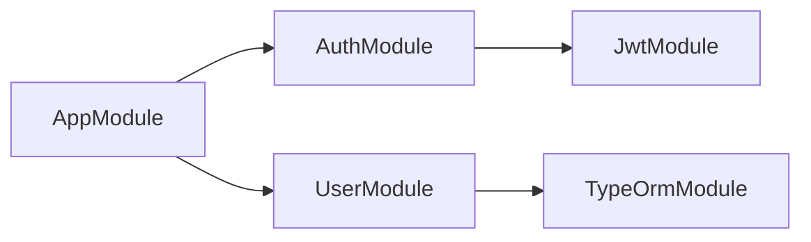
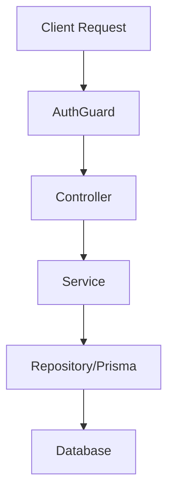
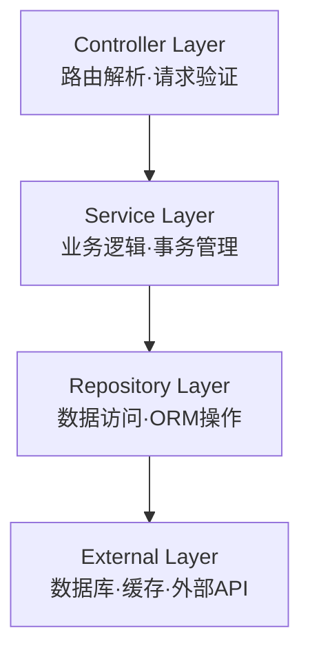

# 排版规范 (文档生成子skill引用)

> 所有文档生成子skill必须遵守以下排版规范，确保跨项目一致性。

---

## 标题层级

```
# 一级标题（文档标题）
## 二级标题（主要章节）
### 三级标题（子章节）
#### 四级标题（表格/代码说明）
```

- 每个文档一级标题 = 文档名（不含 `.md`）
- 二级标题为自然章节划分
- 禁止跳过标题层级（如二级后直接四级）

---

## 表格规范

- 表格必须有表头行
- 表头与数据行之间必须有分隔行
- 内容过长时用 `<br>` 换行，不用表格内列表
- 数值列右对齐，文本列左对齐
- 来源列统一格式：`` `文件名:行号` ``

示例：
| 模块名 | 职责 | 导入来源 | 导出服务 |
|--------|------|---------|---------|
| AuthModule | 认证授权 | `JwtModule` | `AuthService` |
| UserModule | 用户管理 | `TypeOrmModule.forFeature([User])` | `UserService` |

---

## Mermaid图使用要求

### 模块依赖图


### 数据流图


### 架构分层图


---

## 代码片段展示规范

- 只展示核心逻辑片段，不重要部分用注释省略
- 每段代码必须标注文件路径和行号
- 使用 TypeScript 语法高亮

```typescript
// src/auth/auth.service.ts:45-52
@Injectable()
export class AuthService {
  constructor(
    @InjectRepository(User) private userRepo: Repository<User>,
    private jwtService: JwtService,
  ) {}
  // ... 省略非关键逻辑
}
```

---

## 确认度标识

| 标识 | 含义 |
|------|------|
| ✅ | 数据直接从源码提取，已确认 |
| ⚠️ | AI推断，建议人工确认 |
| ❌ | 数据缺失或矛盾 |

---

## 来源字段统一格式

所有来源标注使用统一格式：
- 文件路径：从项目根目录开始（如 `src/auth/auth.service.ts`）
- 行号：冒号分隔（如 `:45-52`）
- 多个来源：分号隔开（如 `src/a.ts:10; src/b.ts:20`）

---

## 不确定性标注

当信息无法完全从源码确认时：
- 参数值不确定：`[推测值: {值}, 建议在 {文件名} 中确认]`
- 逻辑不确定：`[AI推断: 根据代码模式，此方法可能用于...]`
- 缺失数据：`[未找到该信息的源码定义]`
