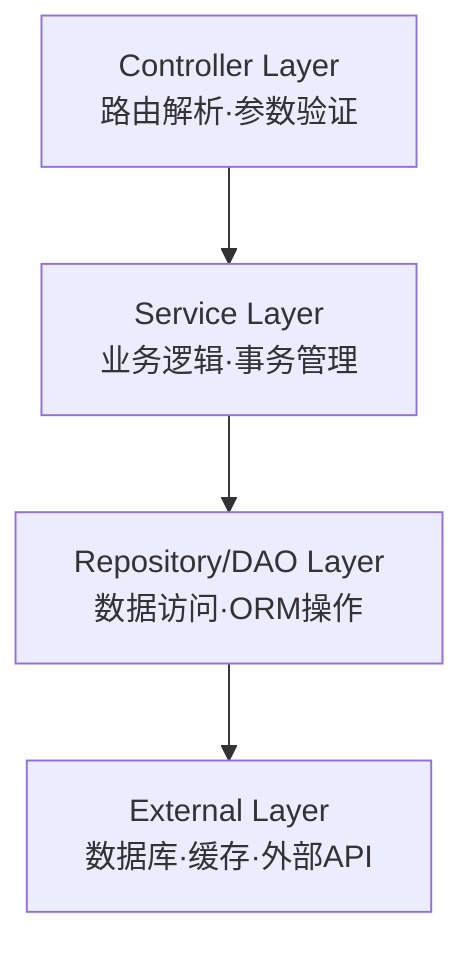
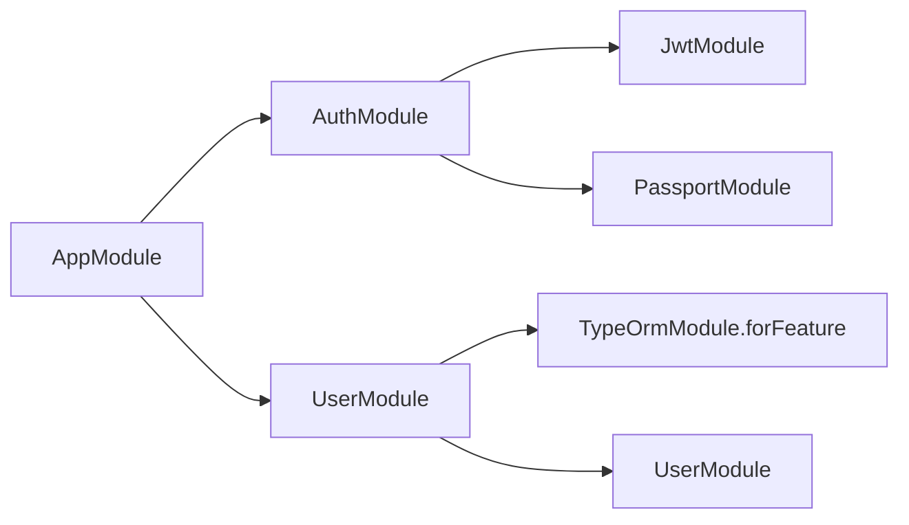

# 子Skill 2: 生成 02_模块架构.md

> **职责**: 读取分析结果，生成 NestJS 模块架构文档。
> **输入**: `_analysis/module_analysis.md`, `_analysis/project_overview.md`
> **输出**: `02_模块架构.md`

---

## 必须遵守的共享规则

开始前先读取:
- `shared/iron_rules.md` — 铁律规则（特别注意铁律4"依赖注入关系必须完整"）
- `shared/format_spec.md` — 排版规范

---

## 执行前：判断运行模式

### 数据读取规则（全新/补厚均适用）
1. 先读 `_analysis/module_analysis.md` → 了解有哪些 Module 需要分析
2. 直接打开 `_snapshot/sources/` 中每个 Module 对应的源文件
3. 从源码提取完整的 imports/exports/controllers/providers 信息
4. `_analysis/` 只作为导航，文档中所有数据来自源码

---

## 文档结构

### 1. NestJS 分层架构总览（新人先看这里）

用 Mermaid 图展示项目的分层架构：

**要求**：
- 每个层标注实际使用的技术（如 TypeORM Repository、Redis Cache）
- 必须基于代码实际结构，不能用通用模板

### 2. 模块依赖图

用 Mermaid 图展示所有 Module 之间的依赖关系：

### 3. 模块清单速查表

| 模块名 | 职责 | 导入的模块 | 导出的服务 | 控制器 |
|--------|------|-----------|-----------|--------|
| AuthModule | 认证授权 | JwtModule, PassportModule | AuthService | AuthController |
| UserModule | 用户管理 | TypeOrmModule | UserService | UserController |

### 4. 模块详细说明（每个模块一个子章节）

#### [Module名称]

**文件**: `src/xxx/xxx.module.ts`

**职责描述**: [一句话说明这个模块负责什么]

**导入的模块**:
- `ModuleName` — 导入原因

**控制器**:
- `XxxController` — `src/xxx/xxx.controller.ts`

**Provider 清单**:

| Token | 实现 | 作用域 |
|-------|------|--------|
| XxxService | XxxService | singleton |
| CUSTOM_TOKEN | { useFactory: ... } | request |

**导出的服务**:
- `XxxService` — 被哪些模块使用

**数据来源**: `_snapshot/sources/xxx/xxx.module.ts`

---

## 输出要求

- 模块依赖图必须基于实际 imports 关系，不能套用通用模板
- 每个模块的 Provider 必须列出所有自定义 provider（含 useFactory/useClass）
- 如果存在循环依赖，必须在文档中特别标注 ⚠️
- 所有模块名和 Token 名必须来自源码，不能猜测
