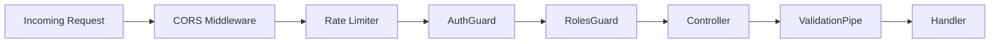

# 子Skill 3: 生成 03_路由与控制器.md

> **职责**: 读取分析结果，生成路由与控制器文档。
> **输入**: `_analysis/route_analysis.md`, `_analysis/middleware_analysis.md`
> **输出**: `03_路由与控制器.md`

---

## 必须遵守的共享规则

开始前先读取:
- `shared/iron_rules.md` — 铁律规则（特别注意铁律1"装饰器参数必须解析"）
- `shared/format_spec.md` — 排版规范

---

## 执行前：判断运行模式

### 数据读取规则（全新/补厚均适用）
1. 先读 `_analysis/route_analysis.md` → 了解所有路由路径
2. 直接打开 `_snapshot/sources/` 中每个 Controller 的源文件
3. 从源码提取完整的路由装饰器参数、守卫、拦截器
4. `_analysis/` 只作为导航，文档中所有数据来自源码

---

## 文档结构

### 1. 路由概览表

| 控制器 | 前缀路径 | 路由数 | 守卫 | 标签(Swagger) |
|--------|---------|--------|------|--------------|
| AuthController | `/api/auth` | 3 | JwtAuthGuard | Auth |
| UserController | `/api/users` | 5 | JwtAuthGuard, RolesGuard | Users |

### 2. 控制器详细说明（每个 Controller 一个子章节）

#### [Controller名称]

**文件**: `src/xxx/xxx.controller.ts`

**路径前缀**: `@Controller('xxx')`

**类级别装饰器**:
- `@UseGuards(JwtAuthGuard)` — 所有路由都需要JWT认证
- `@ApiTags('XXX')` — Swagger 标签

**路由清单**:

| 方法 | 路径 | 完整路径 | HTTP方法 | 守卫 | 管道 | 描述 |
|------|------|---------|---------|------|------|------|
| login | /login | /api/auth/login | POST | - | ValidationPipe | 用户登录 |
| getProfile | /profile | /api/auth/profile | GET | JwtAuthGuard | - | 获取当前用户 |
| updateProfile | /profile | /api/auth/profile | PATCH | JwtAuthGuard | ValidationPipe | 更新个人信息 |

**数据来源**: `_snapshot/sources/xxx/xxx.controller.ts`

### 3. 守卫与认证路由表

| 路由 | 是否需要认证 | 角色要求 | 限流配置 |
|------|------------|---------|---------|
| POST /api/auth/login | ❌ 公开 | - | 10次/分钟 |
| GET /api/users | ✅ 必须 | ADMIN | 100次/分钟 |
| GET /api/users/:id | ✅ 必须 | USER, ADMIN | - |

### 4. 中间件链路图

---

## 输出要求

- 路由的完整路径必须写拼接后的结果（Controller prefix + method decorator）
- 所有守卫必须写出守卫类名，不能只写"使用了守卫"
- 如果路由有 @Public() 或 @SkipAuth() 等自定义装饰器，必须标注
- Swagger 装饰器（@ApiOperation、@ApiResponse）的 summary 必须提取
