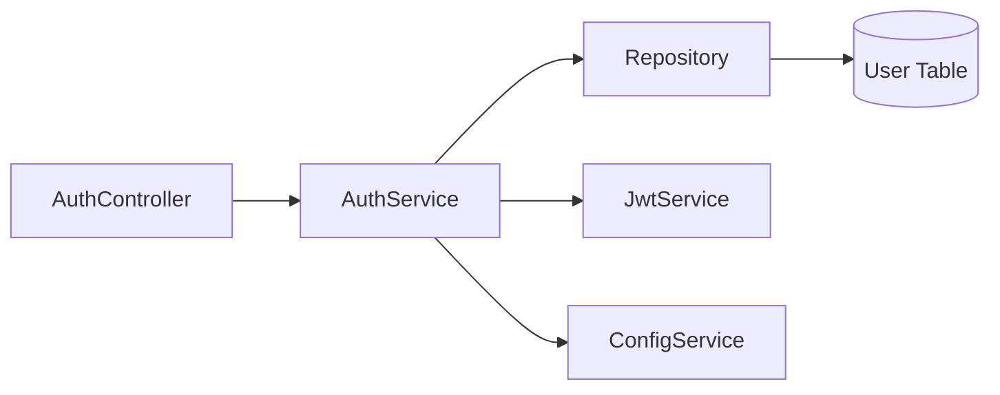

# 子Skill 4: 生成 04_服务与业务逻辑.md

> **职责**: 读取分析结果，生成服务与业务逻辑文档。
> **输入**: `_analysis/service_analysis.md`, `_analysis/module_analysis.md`
> **输出**: `04_服务与业务逻辑.md`

---

## 必须遵守的共享规则

开始前先读取:
- `shared/iron_rules.md` — 铁律规则（特别注意铁律3"为什么比是什么更重要"）
- `shared/format_spec.md` — 排版规范

---

## 执行前：判断运行模式

### 数据读取规则（全新/补厚均适用）
1. 先读 `_analysis/service_analysis.md` → 了解有哪些 Service 和方法
2. 直接打开 `_snapshot/sources/` 中每个 Service 的源文件，**全文通读**
3. 从源码提取完整的方法签名、注入依赖、核心逻辑
4. `_analysis/` 只作为导航，文档中所有数据来自源码

---

## 文档结构

### 1. 服务概览表

| 服务名 | 所属模块 | 公开方法数 | 注入依赖数 | 主要职责 |
|--------|---------|-----------|-----------|---------|
| AuthService | AuthModule | 3 | 2 | 用户认证、Token签发 |
| UserService | UserModule | 5 | 3 | 用户CRUD、权限管理 |
| EmailService | SharedModule | 2 | 1 | 邮件发送模板渲染 |

### 2. 服务详细说明（每个 Service 一个子章节）

#### [Service名称]

**文件**: `src/xxx/xxx.service.ts`

**作用域**: `@Injectable()` — singleton / request / transient

**构造函数依赖注入**:

| 注入Token | 来源模块 | 用途 |
|-----------|---------|------|
| `Repository<User>` | TypeOrmModule | 用户数据访问 |
| `JwtService` | JwtModule | JWT Token 签发验证 |
| `ConfigService` | ConfigModule | 读取配置 |

**公开方法清单**:

##### `async login(loginDto: LoginDto): Promise<AccessTokenDto>`

| 属性 | 值 |
|------|------|
| 参数 | `loginDto: LoginDto` (必填) |
| 返回 | `AccessTokenDto { accessToken, refreshToken }` |
| 抛出 | `UnauthorizedException` — 凭证错误 |
| 逻辑 | 1. 验证用户名密码 → 2. 生成JWT → 3. 保存刷新Token → 4. 返回Token |

**数据来源**: `_snapshot/sources/xxx/xxx.service.ts`

### 3. 依赖注入关系图

---

## 输出要求

- 每个 Service 的构造函数注入必须完整列出
- 方法说明必须包含：参数类型、返回类型、异常抛出、核心逻辑步骤
- 业务逻辑描述要回答"为什么这样实现"（铁律3）
- 事务方法必须标注 @Transactional
- 异步方法必须标注 async
