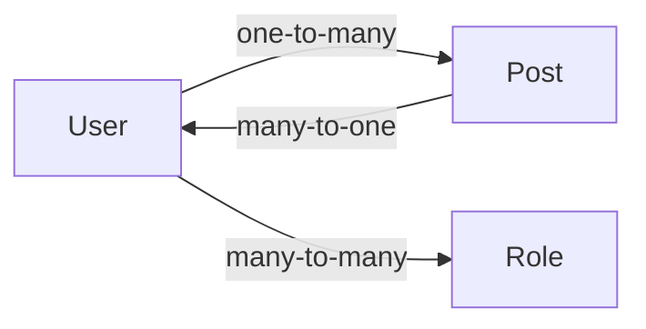
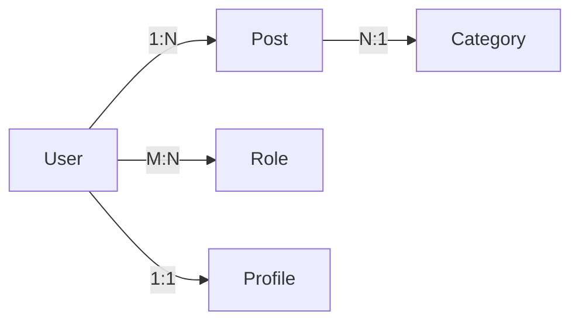

# 子Skill 5: 生成 05_数据模型与DTO.md

> **职责**: 读取分析结果，生成数据模型与DTO文档。
> **输入**: `_analysis/model_analysis.md`, `_analysis/decorator_analysis.md`
> **输出**: `05_数据模型与DTO.md`

---

## 必须遵守的共享规则

开始前先读取:
- `shared/iron_rules.md` — 铁律规则
- `shared/format_spec.md` — 排版规范

---

## 执行前：判断运行模式

### 数据读取规则（全新/补厚均适用）
1. 先读 `_analysis/model_analysis.md` → 了解有哪些 Entity/DTO/Interface
2. 直接打开 `_snapshot/sources/` 中对应的实体和DTO文件
3. 从源码提取所有字段定义、装饰器、验证规则
4. `_analysis/` 只作为导航，文档中所有数据来自源码

---

## 文档结构

### 1. 数据模型总览

| 模型类型 | 名称 | 文件 | 字段数 | 说明 |
|---------|------|------|-------|------|
| Entity | User | user.entity.ts | 8 | 用户表 |
| DTO | CreateUserDto | create-user.dto.ts | 5 | 创建用户请求 |
| DTO | UpdateUserDto | update-user.dto.ts | 4 | 更新用户请求 |
| Interface | JwtPayload | jwt-payload.interface.ts | 3 | JWT载荷结构 |
| Enum | UserRole | user-role.enum.ts | 3 | 用户角色枚举 |

### 2. 实体定义（每个 Entity 一个子章节）

#### User (Entity)

**文件**: `src/users/entities/user.entity.ts`

| 字段名 | 类型 | 数据库类型 | 装饰器 | 说明 |
|--------|------|-----------|--------|------|
| id | number | INT | @PrimaryGeneratedColumn() | 自增主键 |
| email | string | VARCHAR(255) | @Column({ unique: true }) | 邮箱（唯一） |
| password | string | VARCHAR(255) | @Column({ select: false }) | 加密密码 |
| role | UserRole | ENUM | @Column({ type: 'enum', enum: UserRole }) | 用户角色 |
| createdAt | Date | TIMESTAMP | @CreateDateColumn() | 创建时间 |
| posts | Post[] | - | @OneToMany(() => Post) | 关联文章 |

**关系图**:

### 3. DTO 定义（每个 DTO 一个子章节）

#### CreateUserDto

**文件**: `src/users/dto/create-user.dto.ts`

| 字段名 | 类型 | 验证规则 | Swagger 示例 | 必填 |
|--------|------|---------|-------------|------|
| email | string | @IsEmail() | user@example.com | ✅ |
| password | string | @MinLength(6) @MaxLength(20) | ****** | ✅ |
| name | string | @IsOptional() @MinLength(2) | John | ❌ |
| role | UserRole | @IsEnum(UserRole) | USER | ❌ |

**数据来源**: `_snapshot/sources/xxx/dto/create-user.dto.ts`

### 4. 枚举与常量定义

| 枚举名 | 值 | 说明 |
|--------|------|------|
| UserRole.USER | 'user' | 普通用户 |
| UserRole.ADMIN | 'admin' | 管理员 |
| UserRole.MODERATOR | 'moderator' | 版主 |

### 5. 数据模型关系总图

---

## 输出要求

- Entity 字段必须列出所有数据库列装饰器参数
- DTO 必须列出所有 class-validator 验证装饰器
- 关系装饰器（@OneToMany、@ManyToOne 等）必须标明 mappedBy 和 cascade
- Swagger 装饰器的 example 值必须提取
- GraphQL 项目须包含 @InputType/@ObjectType/@Field 装饰器
