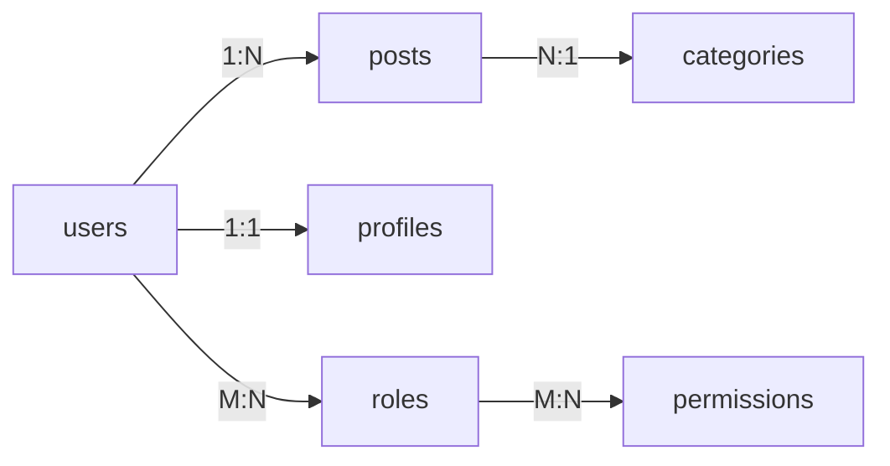
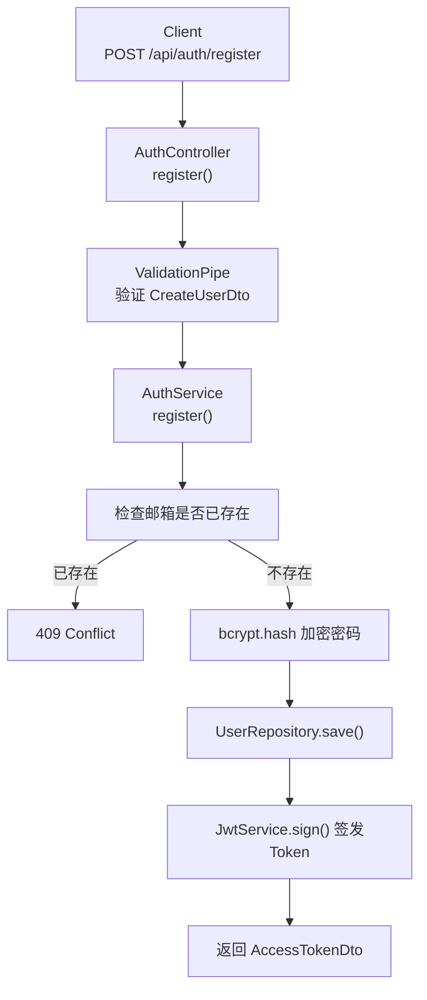
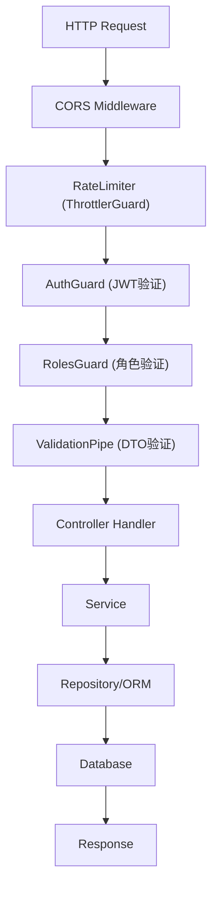

# 子Skill 7: 生成 07_数据库与数据流.md

> **职责**: 读取分析结果，生成数据库与数据流文档。
> **输入**: `_analysis/database_schema.md`, `_analysis/data_flow.md`, `_analysis/model_analysis.md`
> **输出**: `07_数据库与数据流.md`

---

## 必须遵守的共享规则

开始前先读取:
- `shared/iron_rules.md` — 铁律规则
- `shared/format_spec.md` — 排版规范

---

## 执行前：判断运行模式

### 数据读取规则（全新/补厚均适用）
1. 先读 `_analysis/database_schema.md` → 了解表结构
2. 直接打开 `_snapshot/sources/` 中的 Entity、Migration、Seed 文件
3. 从源码提取完整的数据流链路
4. `_analysis/` 只作为导航，文档中所有数据来自源码

---

## 文档结构

### 1. 数据库概览

| 数据库类型 | 版本 | ORM | 表数量 | 迁移工具 |
|-----------|------|-----|--------|---------|
| PostgreSQL | 15 | TypeORM 0.3.x | 8 | TypeORM Migration |
| Redis | 7 | ioredis | - | - |

### 2. 数据库表结构（每个表一个子章节）

#### users 表

| 字段名 | 类型 | 约束 | 默认值 | 说明 |
|--------|------|------|--------|------|
| id | INT | PK, AUTO_INCREMENT | - | 主键 |
| email | VARCHAR(255) | UNIQUE, NOT NULL | - | 邮箱 |
| password | VARCHAR(255) | NOT NULL | - | 加密密码 |
| role | ENUM('user','admin') | NOT NULL | 'user' | 角色 |
| created_at | TIMESTAMP | NOT NULL | CURRENT_TIMESTAMP | 创建时间 |
| updated_at | TIMESTAMP | NOT NULL | CURRENT_TIMESTAMP | 更新时间 |

**索引**:
- `PK_users` — `id`
- `UQ_users_email` — `email`
- `IDX_users_role` — `role`

### 3. 表关系图

### 4. 核心数据流

#### 4.1 用户注册数据流

**关键代码位置**:
- `src/auth/auth.service.ts:30-48` — 注册逻辑
- `src/auth/dto/create-user.dto.ts` — 请求验证

#### 4.2 完整请求-响应链路

---

## 输出要求

- 每个表必须列出所有字段、类型、约束、默认值
- 必须包含索引信息（主键、唯一索引、普通索引）
- 外键关系必须在表关系图中清晰展示
- 核心业务的数据流必须有步骤说明和代码位置标注
- 如果使用了 Redis/MQ 等中间件，必须在数据流中体现
