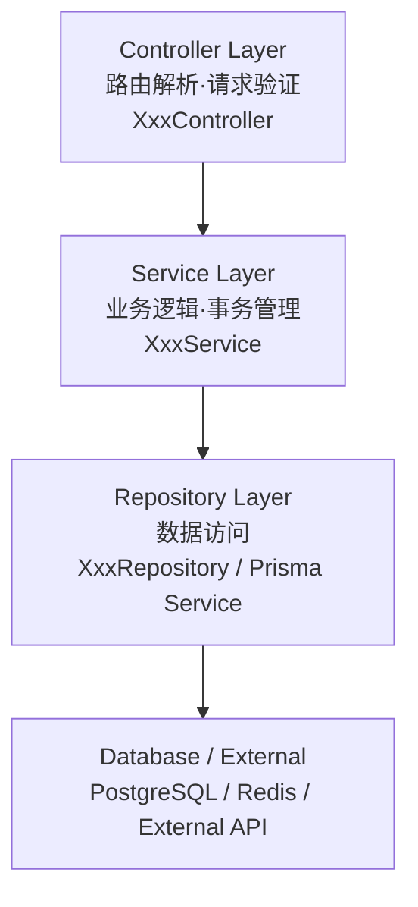

# 子Skill 9: 生成 09_项目结构总览.md

> **职责**: 面向新入职工程师，5分钟能看懂项目全貌的入门文档。
> **输入**: `_analysis/module_analysis.md`, `_analysis/data_flow.md`, `_analysis/project_overview.md`
> **输出**: `09_项目结构总览.md`

---

## 必须遵守的共享规则

开始前先读取:
- `shared/iron_rules.md` — 铁律规则（特别注意铁律8"直接读源码"和铁律9"补厚不覆盖"）
- `shared/format_spec.md` — 排版规范

---

## 执行前：判断运行模式

### 数据读取规则（全新/补厚均适用）
1. 先读 `_analysis/project_overview.md`（文件清单、技术栈）
2. 读 `_analysis/module_analysis.md`（模块依赖关系）→ 了解需要读哪些源文件
3. 直接打开 `_snapshot/sources/` 中各核心文件的前50行（导入关系和文件职责）
4. 从源码提取完整数据
5. `_analysis/` 只作为导航，文档中所有数据来自源码

---

## 文档结构（6个必须章节）

### 第1节：项目是什么（必须是新人能看懂的语言）

**一句话描述**: [项目是做什么的，解决什么业务问题]

**技术栈一句话**:
```
NestJS [版本] + [数据库] + [ORM] + [认证方式]
```

### 第2节：架构分层图（核心，必须有）



**要求**：
- 每个框：实际文件名 + 一句话功能描述
- 不超过5层
- 必须基于代码实际结构，不能用通用模板
- 层次来自 Module imports 依赖关系，不能靠猜

### 第3节：模块清单速查表

| 模块名 | 目录 | 核心文件 | 一句话职责 |
|--------|------|---------|-----------|
| Auth | src/auth | auth.module.ts, auth.service.ts | 登录注册、JWT签发 |
| Users | src/users | users.module.ts, users.service.ts | 用户CRUD、角色管理 |
| Posts | src/posts | posts.module.ts, posts.service.ts | 文章管理、分类 |

### 第4节：系统启动流程（步骤列表，比代码更直观）

```
1. main.ts → NestFactory.create(AppModule)
2. ConfigModule 加载 .env 配置
3. TypeOrmModule 连接数据库
4. 全局 Guards/Pipes/Interceptors 注册
5. SwaggerModule 初始化 API 文档
6. 监听端口 [PORT]
```

**数据来源**: `src/main.ts`, 各 Module 的 `onModuleInit` 方法

### 第5节：新人上手建议（固定格式）

```markdown
## 上手建议

### 第一步：了解核心模块
先看以下3个文件：
- `src/app.module.ts` — 了解哪些模块被注册
- `src/xxx/xxx.controller.ts` — 了解 API 入口
- `src/xxx/xxx.service.ts` — 了解核心业务逻辑

### 第二步：理解数据流
从 Controller → Service → Repository 跟踪一次完整的 CRUD 请求

### 第三步：本地开发
```bash
cp .env.example .env.development
npm install
npm run start:dev
```

### 常用命令
| 命令 | 用途 |
|------|------|
| npm run start:dev | 启动开发服务器（热重载） |
| npm run build | 编译生产版本 |
| npm run migration:run | 执行数据库迁移 |
| npm run test | 运行测试 |
```

### 第6节：文档导航（按受众）

| 身份 | 推荐阅读顺序 |
|------|------------|
| 新入职工程师 | 本文档 → 02_模块架构 → 04_服务与业务逻辑 → 10_核心函数语义 |
| 维护/修改工程师 | 04_服务与业务逻辑 → 03_路由与控制器 → 05_数据模型 → 07_数据库 |
| 技术评审/管理层 | SUMMARY.md（一页纸） |
| 前端对接 | 06_API接口文档 → 05_数据模型与DTO |
| DevOps | 08_配置与环境 → 07_数据库与数据流 |

---

## 输出要求

- 文档面向**完全不了解项目的新人**，语言必须通俗易懂
- 所有文件名必须在源码中真实存在（不能根据命名猜测）
- 所有步骤必须标注源文件:行号
- 架构图必须基于实际 Module 依赖关系，不能套用通用模板
